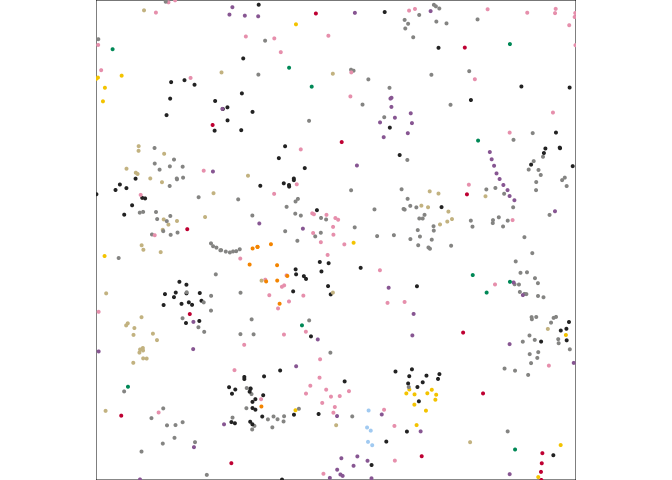

# MicrobialCommunityDistribution

This is the code to create 2D microbial communities and reproduce
figures published in Schmidt et al paper.

<!-- -->

## Usage

To use the function, simply install the package with:

    devtools::install_github("xraynaud/microbial_community_distribution")

To rebuild figures of the paper, download and source the file
`paper_figures.R`.
